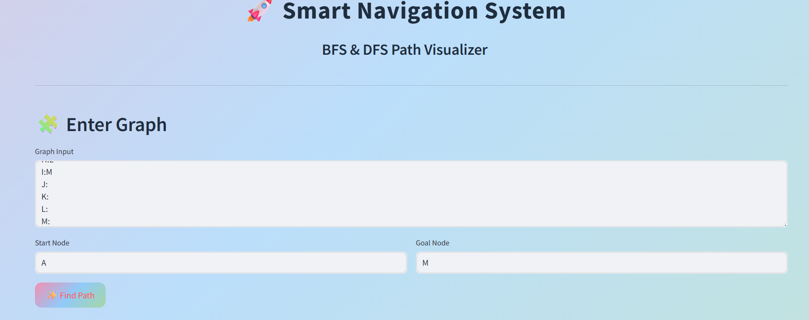
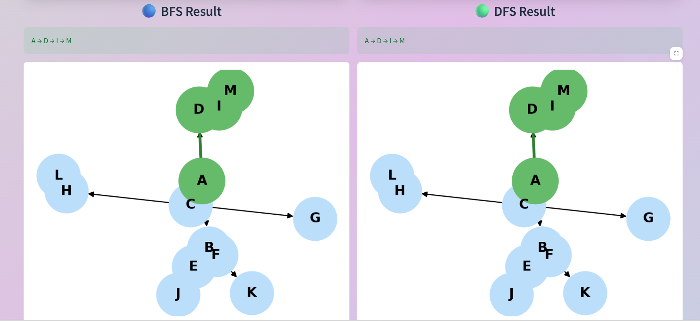
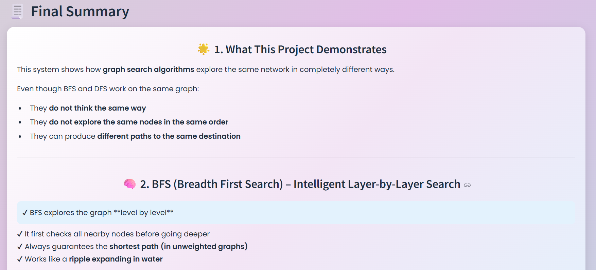
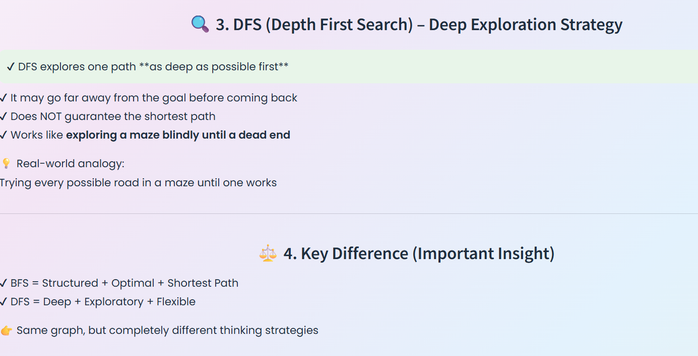
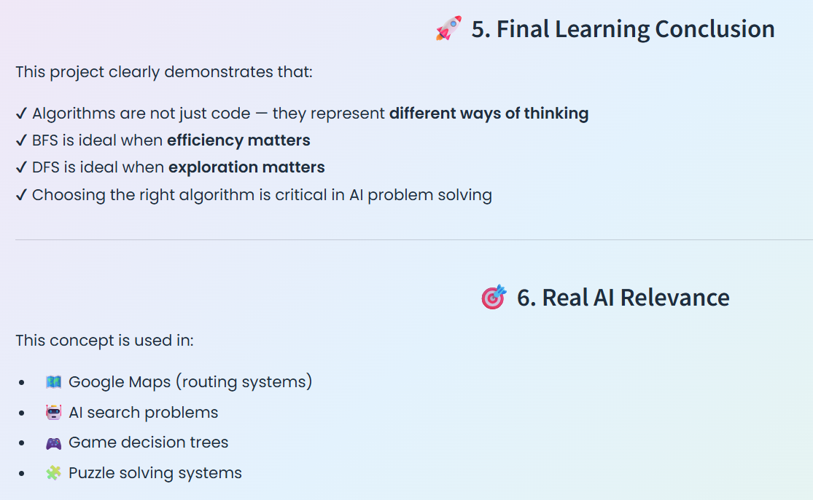
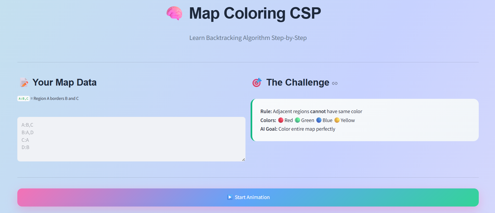
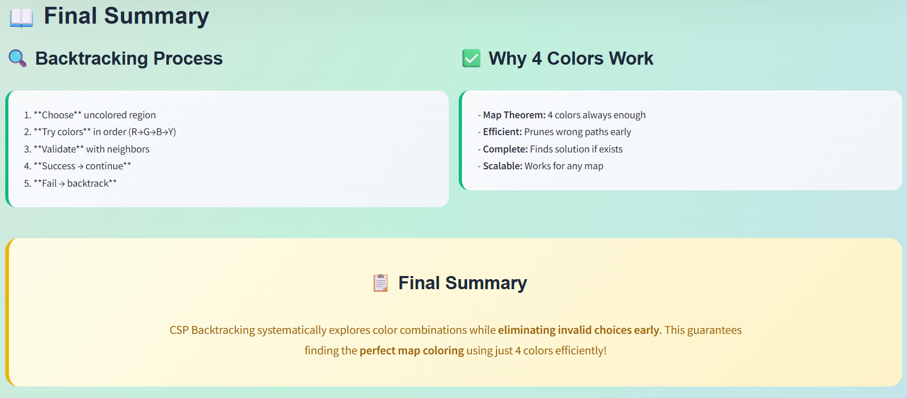

# AI Problem Solving Assignment

## 📌 Repository
AI_ProblemSolving_RA2411026050009_RA2411026050013

---

## 👥 Team Members
- Bavaneesh M (Reg No: RA2411026050009)
- Swathi Palanisamy (Reg No: RA2411026050013)

---

# 🚀 Problem 8: Smart Navigation System (BFS & DFS)

## 🔹 Description
This project implements a Smart Navigation System that finds the best path between a start node and a goal node using **Breadth First Search (BFS)** and **Depth First Search (DFS)** algorithms.

It visually compares how both algorithms explore the same graph differently.

---

## 🧠 Algorithms Used
- Breadth First Search (BFS)
- Depth First Search (DFS)

---

## 📸 Screenshots

### 1️⃣ Graph Input Interface

---

### 2️⃣ BFS vs DFS Visualization
This shows how BFS and DFS explore the same graph differently.

---

### 3️⃣ Final Result Analysis

#### 🟢 Summary View 1

#### 🔵 Summary View 2

#### 🟣 Summary View 3

---

## 🎯 Key Insights
- BFS explores level by level and finds the shortest path
- DFS explores deep paths before backtracking
- Same graph → different intelligent traversal behavior

---

## 🚀 Real-World Applications
- Google Maps routing systems
- AI pathfinding systems
- Game AI decision trees
- Puzzle solving systems

---

---

# 🌈 Problem 5: Map Coloring Problem (CSP)

## 🔹 Description
This project solves the **Map Coloring Problem using Constraint Satisfaction Problem (CSP)** approach.

The goal is to assign colors to regions such that **no adjacent regions share the same color**.

---

## 🧠 Algorithm Used
- Constraint Satisfaction Problem (Backtracking Approach)

---

## 📸 Screenshots

### 1️⃣ CSP Input Interface

---

### 2️⃣ CSP Step-by-Step Process
This shows how constraints are checked during coloring.

---

### 3️⃣ Final Colored Map Output

---

## 🎯 Key Insights
- CSP ensures no constraint violations.
- Uses backtracking to explore valid solutions.
- Efficient for real-world scheduling and assignment problems.

---

## 🚀 Real-World Applications
- Exam scheduling and rescheduling
- Resource allocation
- Map coloring in GIS systems
- AI constraint solving systems

---

---

# 🏁 Final Conclusion (Both Projects)

This assignment demonstrates two powerful AI problem-solving techniques:

✔ Graph Search Algorithms (BFS & DFS)  
✔ Constraint Satisfaction Problem (CSP)

Together, they show how AI can:
- Explore solutions (search problems)
- Satisfy constraints (optimization problems)
- Solve real-world computational challenges efficiently

---

## 📊 Learning Outcome
This project helped understand:
- How different AI strategies behave on the same problem
- Importance of algorithm selection
- Real-world usage of graph and constraint-based AI systems

---

## 🔗 GitHub Repository
https://github.com/Swathi6501/AI_ProblemSolving_RA2411026050009_RA2411026050013